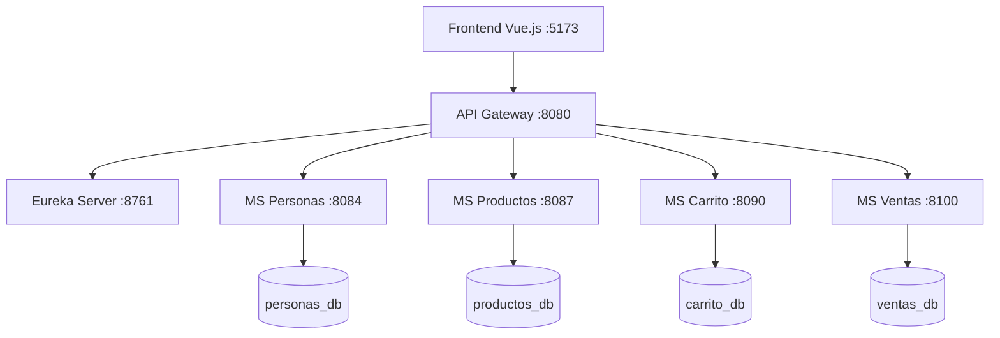

# E-Commerce Microservicios - TP Integrador

Este proyecto es una plataforma de comercio electrónico basada en una arquitectura de microservicios. Permite la gestión de productos, usuarios (personas), carritos de compra y ventas.

## 🏗️ Arquitectura

El sistema está compuesto por los siguientes módulos:

- **Eureka Server**: Servidor de descubrimiento de servicios (Puerto: `8761`).
- **API Gateway**: Punto de entrada único que gestiona el enrutamiento y CORS (Puerto: `8080`).
- **MS Personas**: Gestión de usuarios y perfiles (Puerto: `8084`).
- **MS Productos**: Catálogo de productos y gestión de stock (Puerto: `8087`).
- **MS Carrito**: Gestión del carrito de compras por usuario (Puerto: `8090`).
- **MS Ventas**: Procesamiento de órdenes y registro de ventas (Puerto: `8100`).
- **Frontend**: Aplicación web desarrollada en Vue.js (Puerto: `5173`).



## 🛠️ Tecnologías Utilizadas

### Backend
- **Java 17+**
- **Spring Boot**
- **Spring Cloud** (Eureka, Gateway, OpenFeign)
- **Spring Data JPA**
- **MySQL** (Base de datos)
- **Maven** (Gestión de dependencias)

### Frontend
- **Vue.js 3**
- **Vite**
- **TypeScript**
- **Pinia** (Estado global)
- **CSS Vanilla / Tailwind**

## 🚀 Configuración y Ejecución

### Requisitos Previos
- **Java JDK 17** o superior.
- **Node.js** (v18+) y **npm**.
- **MySQL Server** en ejecución.

### 1. Base de Datos
Crea las bases de datos necesarias en tu instancia de MySQL:
```sql
CREATE DATABASE personas_db;
CREATE DATABASE productos_db;
CREATE DATABASE carrito_db;
CREATE DATABASE ventas_db;
```

### 2. Levantar el Backend (Orden Recomendado)
Es importante seguir este orden para asegurar que los servicios se registren correctamente:

1. **Eureka Server**: Entrar a `eureka-server/` y ejecutar `./mvnw spring-boot:run`
2. **Microservicios**: Ejecutar cada uno (`ms-personas`, `ms-productos`, `ms-carrito`, `ms-ventas`) usando `./mvnw spring-boot:run`.
3. **API Gateway**: Entrar a `api-gateway/` y ejecutar `./mvnw spring-boot:run`.

> [!TIP]
> Puedes verificar el estado de los servicios en el panel de Eureka: `http://localhost:8761`

### 3. Levantar el Frontend
1. Navegar a `frontend/ecommerce-front/`.
2. Instalar dependencias: `npm install`.
3. Ejecutar en modo desarrollo: `npm run dev`.
4. Acceder a `http://localhost:5173`.

## 📖 Documentación de la API
Cada microservicio expone su propia documentación Swagger, pero el **API Gateway** las agrupa todas para facilitar el acceso:

- **Swagger UI Agregado**: `http://localhost:8080/swagger-ui.html`

## 📄 Notas Adicionales
- El API Gateway está configurado para permitir CORS desde `http://localhost:5173`.
- Asegúrate de configurar correctamente las credenciales de base de datos en los archivos `application.properties` de cada microservicio si difieren de las por defecto (`root` sin contraseña).
